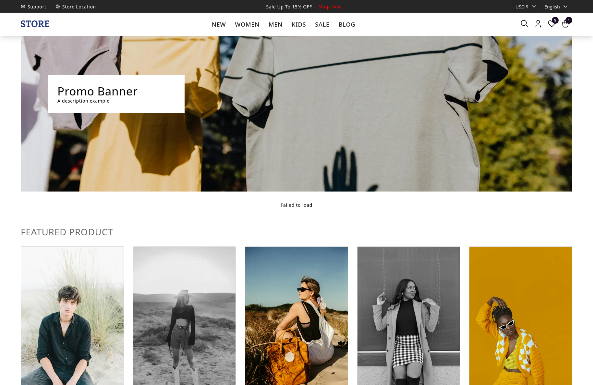

# NEXTJS-PRESENTATION

This project is a web application built with **Quart**, a Python web framework, designed for managing products, categories, and related features. The backend is powered by **SQLAlchemy** for database interaction, **Flask Marshmallow** for serialization, and **Flask Caching** for optimized performance. The application is structured for scalability, using blueprints to organize different routes and controllers.

## Features

- **Product Management**: Handles product information such as name, price, promotional details, and category association.
- **Category Management**: Allows retrieval of product categories, including featured categories.
- **Cache Management**: Implements caching for better performance in repetitive requests.
- **Database Support**: Uses **PostgreSQL** for data storage, with migrations handled by SQL scripts.
- **API Endpoints**: Exposes RESTful endpoints for products and categories.

## Installation

### Backend

1. Install Python 3.10 (recommended version).
2. Set up the virtual environment and install dependencies:
   ```bash
   make backend-install
   ```

### Frontend


1. Navigate to the frontend directory:
   ```bash
   cd frontend
   ```

2. Install frontend dependencies:
   ```bash
   npm install
   ```

## Running the Application

To start the backend:

```bash
make backend-start
```

To start the frontend:

```bash
make frontend-start
```

To start the application with Hypercorn (production server):

```bash
make hypercorn-start
```

### Database Setup

1. Start the database (Docker or Podman recommended):
   ```bash
   make database-start
   ```

2. Run migrations (if any):
   ```bash
   make db-migrate
   ```

3. To create a new migration file:
   ```bash
   make db-migration NAME="migration_name"
   ```

## Configuration

This project uses **Quart** for the web framework and **SQLAlchemy** for ORM, with **Marshmallow** for serialization. Database and other configurations are loaded from environment variables and configuration files.

## Structure

- **Backend**: Contains all backend logic, including models, controllers, and database migrations.
- **Frontend**: Holds the frontend assets, including React components (if applicable).
- **Docker**: For containerization of the app and database.

## License

This project is licensed under the MIT License - see the [LICENSE](LICENSE) file for details.
